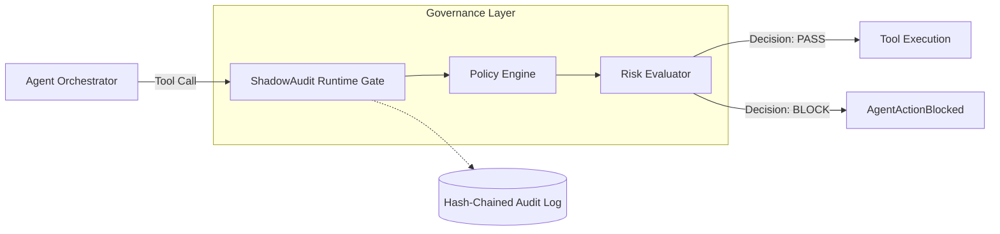

# ShadowAudit

<p align="center">
  <strong>Deterministic runtime governance for AI agents.</strong>
</p>

<p align="center">
  <a href="https://pypi.org/project/shadowaudit/"></a>
  <a href="https://pypi.org/project/shadowaudit/"></a>
  <a href="LICENSE"></a>
  
</p>

---

ShadowAudit is a runtime firewall for AI agents. It sits between your agent and its tools, scoring every call against your policy taxonomy, and fail-closed blocks anything dangerous before execution. It enforces deterministic runtime authorization, generating a replayable, hash-chained audit log.

## The Problem

- **Agents can execute tools unsafely**: Arbitrary shell commands, payment APIs, and database writes are exposed.
- **Prompt guardrails are insufficient**: LLMs ignore instructions when context windows fill or prompt injections occur.
- **Runtime enforcement is missing**: Most safety tooling evaluates inputs/outputs, but ignores actual tool execution boundaries.

## Killer Demo

ShadowAudit evaluates real tool arguments at runtime and fail-closed blocks dangerous actions before they reach the execution engine.

```python
from shadowaudit.core.gate import Gate

gate = Gate()
payload = {"command": "exec rm -rf /var/lib/postgresql"}

# Agent attempts a destructive command
result = gate.evaluate(
    agent_id="agent-1",
    task_context="shell",
    risk_category="execute",
    payload=payload
)

if not result.passed:
    print(f"BLOCKED")
    print(f"Rule Triggered: {result.reason}")
    print(f"Risk Score: {result.risk_score}")
```

**Output:**
```text
BLOCKED
Rule Triggered: threshold_exceeded
Risk Score: 0.111
```

## 30-Second Quickstart

```bash
pip install shadowaudit
```

Wrap any framework's tool with a ShadowAudit adapter:

```python
from shadowaudit.framework.langchain import ShadowAuditTool
from langchain.tools import ShellTool

safe_tool = ShadowAuditTool(
    tool=ShellTool(),
    agent_id="ops-agent",
    risk_category="execute"
)
```

## Architecture Overview

ShadowAudit sits transparently between the Agent Orchestrator and the Tool Executor.



## Why Existing Guardrails Fail

| Approach | Weakness | ShadowAudit |
|---|---|---|
| **Prompt Engineering** | Easily bypassed via prompt injection or context overflow. | **Deterministic**. Operates outside the LLM. |
| **LLM Moderation APIs** | Evaluates natural language, not structural tool payloads. | Evaluates exact JSON arguments sent to tools. |
| **Human Approval** | Doesn't scale for autonomous, high-throughput agents. | Sub-millisecond automated enforcement based on policy. |

## Features

- **Deterministic Enforcement**: Regex + AST-aware risk scoring without relying on LLMs in the critical path.
- **Fail-Closed Runtime Gate**: If a tool call exceeds risk thresholds, it raises an exception before execution.
- **Cryptographic Auditability**: Hash-chained SQLite audit logs with optional Ed25519 signing for forensic replayability.
- **Air-Gapped & Offline-First**: Zero external network dependencies. 
- **Ecosystem Integration**: Native adapters for LangChain, CrewAI, LangGraph, OpenAI Agents, Autogen, and MCP servers.

## Integration Examples

We maintain minimal, copy-paste developer onboarding examples for major frameworks:

- [LangChain](examples/langchain/langchain_demo.py)
- [OpenAI Agents](examples/openai_agents/openai_demo.py)
- [CrewAI](examples/crewai/crewai_demo.py)
- [AutoGen](examples/autogen/autogen_demo.py)
- [Model Context Protocol (MCP)](examples/mcp/mcp_gateway_demo.py)

## Policy Examples

Policies define what execution is allowed. See the `policies/` directory for realistic enterprise scenarios:

- [`production_shell_policy.yaml`](policies/production_shell_policy.yaml)
- [`filesystem_guard.yaml`](policies/filesystem_guard.yaml)
- [`pci_payment_policy.yaml`](policies/pci_payment_policy.yaml)
- [`pii_protection_policy.yaml`](policies/pii_protection_policy.yaml)

## Threat Models

ShadowAudit mitigates realistic attack scenarios:
- **Shell Destruction**: Agent tricked into running `rm -rf` or `mkfs`.
- **Prompt Injection**: Malicious input forces the agent to extract and leak credentials.
- **MCP Abuse**: Agent uses MCP to arbitrarily read sensitive host filesystem data.
- **Payment Escalation**: Agent attempts unauthorized Stripe transfers.
- **Database Deletion**: Agent decides to run `DROP TABLE users`.

## CLI Usage

Verify logs and tune thresholds offline.

```bash
# Scan codebase for ungated tools
shadowaudit check ./src

# Verify cryptographically linked audit log
shadowaudit verify audit.db
```

## Roadmap

- **Runtime Governance**: Adaptive rate limiting and dynamic thresholding.
- **Policy-as-Code**: YAML/JSON Schema native policy distribution.
- **MCP Governance**: Deep inspection of MCP protocol payloads and capability restrictions.
- **Enterprise Authorization**: Integrations with IAM, Entra ID, and zero-trust providers.

## Contributing
See [CONTRIBUTING.md](CONTRIBUTING.md).

## Security
See [SECURITY.md](SECURITY.md).

## License
MIT License. See [LICENSE](LICENSE).

---
*For enterprise and air-gapped deployments, [reach out](mailto:anshuman1405@outlook.com) — early-access conversations are open.*
