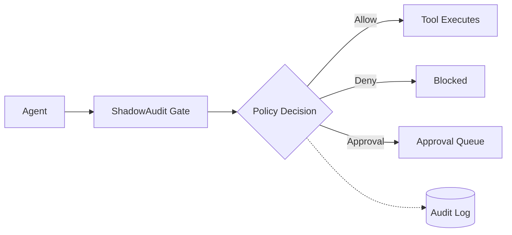
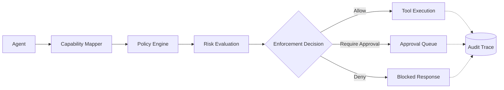

# ShadowAudit

<p align="center">
  <strong>Deterministic, fail-closed runtime authorization for AI agents.</strong>
</p>

<p align="center">
  <a href="https://pypi.org/project/shadowaudit/"></a>
  <a href="https://img.shields.io/pypi/pyversions/shadowaudit"></a>
  <a href="LICENSE"></a>
  
</p>

ShadowAudit sits between AI agents and their tools to enforce deterministic authorization before execution happens.

Release: v0.6.1 — 2026-05-13 — 253 tests passed

Documentation: https://shadowauditlabs.github.io/shadowaudit-python/

It is infrastructure for governing agent tool use at runtime: closer to IAM, Open Policy Agent, admission controllers, and API gateways than prompt guardrails or moderation.

```text
Agent → ShadowAudit → Tool
          │
          ├─ Allow
          ├─ Deny
          └─ Require approval
```

Example: a finance agent can read invoices freely, but a `payments.transfer` call over `$1,000` is paused for approval, and a shell command like `rm -rf /var/lib/postgresql` is denied before it runs.

---

## Why ShadowAudit Exists

Prompts and moderation can shape model behavior,
but they are not deterministic authorization systems.

They depend on the model, are probabilistic by nature,
and usually run before the final tool execution point.

ShadowAudit enforces explicit runtime policy
at the point where execution actually happens.

---

## How It Works

ShadowAudit wraps agent tools with a runtime gate.

When an agent attempts to use a tool, ShadowAudit evaluates the request against explicit policy-as-code. The gate returns one of three outcomes:

- **allow**: execute the tool
- **deny**: block execution before the tool runs
- **require approval**: send the request to a human approval workflow



Enforcement is deterministic and fail-closed. If a tool call is not authorized, it does not execute.

---

## Quickstart

```bash
pip install shadowaudit
```

```python
from shadowaudit import ShadowAuditTool
from langchain.tools import ShellTool

safe_tool = ShadowAuditTool(
    tool=ShellTool(),
    agent_id="ops-agent",
    capability="shell.execute",
    policy_path="policies/production_shell_policy.yaml"
)
```

Example policy:

```yaml
deny:
  - capability: filesystem.delete
  - capability: shell.root_access

require_approval:
  - capability: payments.transfer
    amount_gt: 1000

allow:
  - capability: filesystem.read
```

Supported integrations:

- LangChain
- LangGraph
- CrewAI
- OpenAI Agents SDK
- MCP
- Direct Python APIs

---

## Direct Gate API

Use the core gate directly when you want ShadowAudit inside your own runtime, framework adapter, MCP gateway, or infrastructure workflow.

```python
from shadowaudit.core.gate import Gate

gate = Gate()

result = gate.evaluate(
    agent_id="ops-agent-1",
    task_context="shell",
    risk_category="shell_execution",
    capability="shell.execute",
    policy_path="policies/production_shell_policy.yaml",
    payload={
        "command": "rm -rf /var/lib/postgresql"
    }
)

if not result.passed:
    print("BLOCKED")
    print(f"Capability: shell.execute")
    print(f"Decision: denied")
    print(f"Reason: {result.reason}")
```

Expected output:

```text
BLOCKED
Capability: shell.execute
Decision: denied
Reason: destructive_command_detected
```

ShadowAudit automatically extracts numeric fields such as `amount`, `total`, and `value` from tool arguments so policies can evaluate conditions like `amount_gt`.

---

## Why ShadowAudit Is Different

ShadowAudit is not a prompt wrapper, moderation layer, or generic observability SDK. It is runtime authorization infrastructure for agent tool execution.

| Capability | What it means |
| --- | --- |
| Deterministic runtime enforcement | The same request and policy produce the same decision. |
| Fail-closed execution | Unauthorized tool calls are blocked before execution. |
| No LLM dependency in the enforcement path | Policy evaluation does not depend on a model call. |
| Policy-as-code | Authorization rules live in explicit, reviewable policy files. |
| Offline-first enforcement | The gate can run without cloud services or network access. |
| Approval workflows | Sensitive actions can pause for human approval instead of being blindly allowed or denied. |
| Replayable execution trails | Decisions can be replayed for debugging, incident response, and audit review. |
| Tamper-evident audit chain | Runtime decisions are stored in a hash-chained audit log. |
| Cryptographic verification | Audit logs can be verified and optionally signed with Ed25519. |

The goal is simple: an agent should not be able to execute a sensitive action unless a deterministic runtime policy allows it.

---

## Auditability and Replay

Every runtime decision can be recorded in an append-only SQLite audit log.

Audit entries are:

- SHA-256 hash chained
- replayable
- tamper-evident
- optionally signed with Ed25519

Modify any row and the verification chain breaks.

```bash
shadowaudit verify --audit-log audit.db
```

Example audit entry:

```json
{
  "timestamp": 1715492534.123,
  "agent_id": "finance-agent",
  "capability": "payments.transfer",
  "decision": "require_approval",
  "payload_hash": "a8f5f167f44f...",
  "previous_hash": "9ab12de...",
  "signature": "ed25519:..."
}
```

Forensic workflows:

```bash
shadowaudit replay trace.jsonl
shadowaudit trace <entry_hash>
shadowaudit logs --audit-log audit.db
```

Replay output can show triggered rules, capability mapping, enforcement decisions, risk deltas, and the final decision path.

---

## Approval Workflows

Policies can require approval for sensitive capabilities.

```yaml
require_approval:
  - capability: production.database.write
  - capability: payments.transfer
    amount_gt: 1000
```

```bash
shadowaudit pending-approvals
shadowaudit approve req-1234
shadowaudit reject req-1234
```

Every approval or rejection is recorded as part of the audit trail.

---

## Observe Mode

Use observe mode to roll out policies before enforcing them.

```python
from shadowaudit.core.gate import Gate

gate = Gate(mode="observe")
```

Observe mode logs decisions without blocking execution. This lets teams see what would have been denied before switching to fail-closed enforcement.

---

## CI/CD Enforcement

ShadowAudit can scan codebases for ungated agent tools and fail CI when high-risk tools are not protected.

```bash
shadowaudit check ./src --fail-on-ungated
```

Replay traces against policy changes before rollout:

```bash
shadowaudit simulate --trace-file session.jsonl --taxonomy alternative.yaml --compare
```

This supports:

- governance regression testing
- enforcement simulation
- policy diff analysis
- safer rollout workflows

---

## Advanced Capabilities

The core primitive is runtime authorization. ShadowAudit also includes deeper infrastructure for complex agent systems.

### MCP Governance

Put ShadowAudit in front of MCP tools.

```python
from shadowaudit.mcp.gateway import MCPGatewayServer

gateway = MCPGatewayServer(
    upstream_command=[
        "python",
        "-m",
        "mcp_server_filesystem",
        "/tmp"
    ],
    policy_path="policies/mcp_restrictions.yaml"
)

gateway.run()
```

### FlowTracer and Trust Propagation

FlowTracer tracks how data moves across agents and preserves trust boundaries through chained workflows.

```python
from shadowaudit import FlowTracer, TrustLevel

tracer = FlowTracer()

tracer.record_output(
    "web-scraper",
    scraped_data,
    trust=TrustLevel.UNTRUSTED
)

tracer.record_flow(
    "web-scraper",
    "payment-agent",
    parsed_data
)

annotation = tracer.annotate(
    receiving_agent="payment-agent",
    source_agents=["web-scraper"],
    declared_trust=TrustLevel.SYSTEM,
)

print(annotation.effective_trust)
```

This is useful for:

- multi-agent systems
- autonomous workflows
- MCP ecosystems
- chained execution graphs

FlowTracer is an observability primitive designed to integrate with dynamic risk threshold plugins.

### Compliance and Reporting

ShadowAudit includes reporting helpers for governance and assurance teams.

```bash
shadowaudit owasp
shadowaudit eu-ai-act ./src
```

Included mappings and reports:

- OWASP Agentic Top 10 coverage
- EU AI Act Annex IV evidence packs
- HTML governance reports
- structured audit exports

### Governance Lifecycle



Every decision is:

- deterministic
- replayable
- explainable
- cryptographically auditable

### Internal Architecture

```text
┌─────────────────────────────────────────────────────┐
│                  ShadowAudit                        │
├─────────────┬─────────────┬─────────────┬──────────┤
│ LangChain  │  CrewAI     │ LangGraph   │   MCP    │
│ OpenAI SDK │ Direct Gate │ FlowTracer  │ Gateway  │
├─────────────────────────────────────────────────────┤
│               Core Gate Engine                      │
│                                                     │
│ Capability Mapper → Policy Engine → Enforcement FSM │
│                                                     │
│  Risk Engine    │ Replay Engine │ Audit Chain       │
│  Thresholds     │ Simulator     │ SHA-256 + Ed25519 │
│                                                     │
├─────────────────────────────────────────────────────┤
│          SQLite State + Audit Storage               │
└─────────────────────────────────────────────────────┘
```

---

## Examples

See `examples/` for runnable demos including:

- LangChain agents
- MCP governance
- tamper-evident audit verification
- fintech payment agents
- FlowTracer demos
- observe mode rollouts
- replay and simulation workflows

```bash
python examples/core_concepts/run_all_examples.py
```

---

## Project Status

ShadowAudit is production-ready for:

- runtime tool gating
- deterministic authorization
- fail-closed execution
- audit-time replay
- policy-as-code enforcement
- approval workflows
- compliance evidence generation

Current capabilities:

- LangChain, CrewAI, LangGraph, OpenAI Agents SDK, and MCP adapters
- hash-chained audit logs
- Ed25519 signing
- replay and simulation engine
- FlowTracer trust propagation
- vertical taxonomies
- OWASP and EU AI Act reporting
- offline-first operation
- zero LLM calls in the enforcement path

Designed for:

- regulated workloads
- fintech
- healthcare
- air-gapped environments
- enterprise governance teams
- production agent infrastructure

---

## Contributing

```bash
git clone https://github.com/AnshumanKumar14/shadowaudit-python.git

cd shadowaudit-python

pip install -e ".[dev]"

pytest tests/ -q
```

Bug reports, governance plugins, framework adapters, and policy contributions are welcome.

---

## License

MIT License

---

<p align="center">
  <sub>Built by <a href="https://github.com/AnshumanKumar14">Anshuman Kumar</a></sub>
</p>
