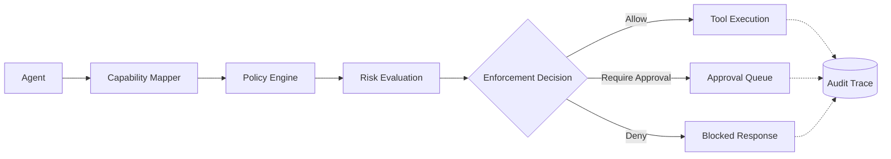

# Runtime authorization for AI agents

ShadowAudit provides runtime authorization and deterministic policy enforcement for AI agent execution. It sits between an agent and its tools to evaluate capabilities, apply context-aware policies, and deterministically block or pause unsafe actions before they reach your infrastructure.

## The Problem

Agents can now execute real-world tools—writing to databases, provisioning infrastructure, and executing shell commands. However, existing security measures like prompt guardrails are fundamentally probabilistic. LLMs will ignore instructions during prompt injections, context overflows, or complex reasoning chains. 

To run agents in production, execution boundaries require deterministic enforcement.

## Dangerous Tool Execution Blocked

ShadowAudit evaluates real tool arguments at runtime and fail-closed blocks dangerous actions before they reach the execution engine.

```python
from shadowaudit.core.gate import Gate

gate = Gate(policy_path="policies/production_shell_policy.yaml")

# Agent attempts a destructive command
result = gate.evaluate(
    agent_id="ops-agent-1",
    task_context="shell",
    capability="shell.execute",
    payload={"command": "rm -rf /var/lib/postgresql"}
)

if not result.passed:
    print("BLOCKED")
    print(f"Capability: {result.metadata.get('capability', 'shell.execute')}")
    print(f"Risk Level: critical")
    print(f"Policy: production_shell_policy")
    print(f"Action: denied")
```

**Expected Output:**
```text
BLOCKED
Capability: shell.execute
Risk Level: critical
Policy: production_shell_policy
Action: denied
```

## Quickstart

Wrap any framework's tool with a lightweight ShadowAudit adapter to instantly govern execution.

```bash
pip install shadowaudit pyyaml
```

```python
from shadowaudit.framework.langchain import ShadowAuditTool
from langchain.tools import ShellTool

# Wrap the tool to enforce policies transparently
safe_tool = ShadowAuditTool(
    tool=ShellTool(),
    agent_id="ops-agent",
    capability="shell.execute"
)
```

## Policy-as-Code

ShadowAudit uses a deterministic, YAML-based policy engine designed for scale and enterprise environments.

```yaml
deny:
  - capability: filesystem.delete
  - capability: shell.root_access

require_approval:
  - capability: payments.transfer
    amount_gt: 1000

allow:
  - capability: filesystem.read
```

## Runtime Governance Lifecycle


