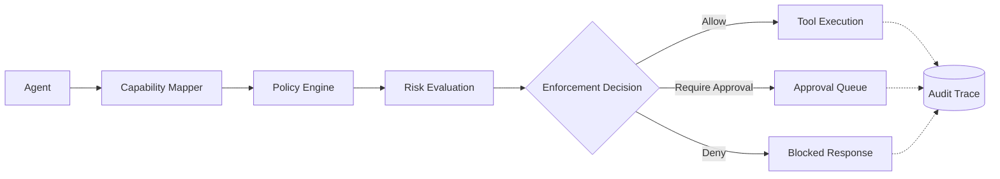

# ShadowAudit

<p align="center">
  <strong>Deterministic runtime authorization and fail-closed governance for AI agent tool execution.</strong>
</p>

<p align="center">
  <a href="https://pypi.org/project/shadowaudit/"></a>
  <a href="https://img.shields.io/pypi/pyversions/shadowaudit"></a>
  <a href="LICENSE"></a>
  
</p>

---

Your AI agents can execute shell commands, transfer money, modify databases, access MCP servers, and trigger production infrastructure workflows.

ShadowAudit sits between agents and their tools to enforce deterministic runtime authorization before execution happens.

Unlike prompt guardrails or probabilistic moderation systems, ShadowAudit fail-closed blocks unsafe actions at runtime using explicit policies, replayable audit trails, and cryptographically verifiable enforcement logs.

```text
Agent → ShadowAudit Gate → Tool Execution
                           → Blocked (AgentActionBlocked)
                           → Approval Queue
```

---

## Runtime Governance Guarantees

- Deterministic fail-closed enforcement
- Cryptographically verifiable audit trails
- Replayable execution decisions
- Offline-first runtime governance
- Zero LLM calls in enforcement path
- Explainable enforcement outcomes
- CI/CD deployment enforcement
- Multi-agent trust propagation
- MCP governance support
- Tamper-evident SHA-256 + Ed25519 audit chain

---

# Quickstart

```bash
pip install shadowaudit
```

```python
from shadowaudit import ShadowAuditTool
from langchain.tools import ShellTool

safe_tool = ShadowAuditTool(
    tool=ShellTool(),
    agent_id="ops-agent",
    capability="shell.execute",
    policy_path="policies/production_shell_policy.yaml"
)
```

Supported integrations:
- LangChain
- LangGraph
- CrewAI
- OpenAI Agents SDK
- MCP
- Direct Python APIs

---

# Under the Hood (Direct API)

```python
from shadowaudit.core.gate import Gate

gate = Gate(policy_path="policies/production_shell_policy.yaml")

result = gate.evaluate(
    agent_id="ops-agent-1",
    task_context="shell",
    risk_category="shell_execution",
    capability="shell.execute",
    payload={
        "command": "rm -rf /var/lib/postgresql"
    }
)

if not result.passed:
    print("BLOCKED")
    print(f"Capability: shell.execute")
    print(f"Decision: denied")
    print(f"Reason: {result.reason}")
```

Expected output:

```text
BLOCKED
Capability: shell.execute
Decision: denied
Reason: destructive_command_detected
```

---

# Policy-as-Code

```yaml
deny:
  - capability: filesystem.delete
  - capability: shell.root_access

require_approval:
  - capability: payments.transfer
    amount_gt: 1000

allow:
  - capability: filesystem.read
```

Policies support:
- capability-based authorization
- threshold enforcement
- escalation workflows
- environment-specific rules
- replay + simulation testing

> **Note:** ShadowAudit automatically extracts numeric fields (like `amount`, `total`, `value`) from unstructured tool arguments to evaluate dynamic conditions like `amount_gt`.

---

# Runtime Governance Lifecycle



Every decision is:
- deterministic
- replayable
- explainable
- cryptographically auditable

---

# Tamper-Evident Audit Trails

Every runtime decision is recorded in an append-only SQLite audit log.

Audit entries are:
- SHA-256 hash chained
- replayable
- tamper-evident
- optionally signed with Ed25519

Modify any row and the verification chain breaks.

```bash
shadowaudit verify audit.db
```

Example audit entry:

```json
{
  "timestamp": 1715492534.123,
  "agent_id": "finance-agent",
  "capability": "payments.transfer",
  "decision": "require_approval",
  "payload_hash": "a8f5f167f44f...",
  "previous_hash": "9ab12de...",
  "signature": "ed25519:..."
}
```

This enables:
- forensic replay
- compliance evidence
- chain-of-custody verification
- deterministic auditability

---

# Replay + Explainability

```bash
shadowaudit replay trace.jsonl
```

```bash
shadowaudit trace <trace_id>
```

Replay output includes:
- triggered rules
- capability mapping
- enforcement chain
- risk deltas
- final decision path

---

# Observe Mode + Human Approval Workflows

```python
gate = Gate(mode="observe")
```

Observe mode:
- logs all decisions
- blocks nothing
- records what would have been denied

```yaml
require_approval:
  - capability: production.database.write
```

```bash
shadowaudit pending-approvals
shadowaudit approve req-1234
```

Every override is permanently audit logged with reason tracking.

---

# Multi-Agent Trust Propagation

```python
from shadowaudit import FlowTracer, TrustLevel

tracer = FlowTracer()

tracer.record_output(
    "web-scraper",
    scraped_data,
    trust=TrustLevel.UNTRUSTED
)

tracer.record_flow(
    "web-scraper",
    "payment-agent",
    parsed_data
)

annotation = tracer.annotate(
    receiving_agent="payment-agent",
    source_agents=["web-scraper"],
    declared_trust=TrustLevel.SYSTEM,
)

print(annotation.effective_trust)
```

This enables governance across:
- multi-agent systems
- autonomous workflows
- MCP ecosystems
- chained execution graphs

*Note: FlowTracer is an observability primitive designed to integrate with upcoming dynamic risk threshold plugins.*

---

# MCP Governance

```python
from shadowaudit.mcp.gateway import MCPGatewayServer

gateway = MCPGatewayServer(
    upstream_command=[
        "python",
        "-m",
        "mcp_server_filesystem",
        "/tmp"
    ],
    policy_path="policies/mcp_restrictions.yaml"
)

gateway.run()
```

---

# CI/CD Enforcement

```bash
shadowaudit check ./src --fail-on-ungated
```

```bash
shadowaudit simulate session.json --policy alternative.yaml --compare
```

This enables:
- governance regression testing
- enforcement simulation
- policy diff analysis
- safer rollout workflows

---

# Compliance + Reporting

ShadowAudit includes:
- OWASP Agentic Top 10 mappings
- EU AI Act Annex IV evidence packs
- HTML governance reports
- structured audit exports

```bash
shadowaudit owasp
shadowaudit eu-ai-act
```

Designed for:
- regulated workloads
- fintech
- healthcare
- air-gapped environments
- enterprise governance teams

---

# Architecture

```text
┌─────────────────────────────────────────────────────┐
│                  ShadowAudit                        │
├─────────────┬─────────────┬─────────────┬──────────┤
│ LangChain  │  CrewAI     │ LangGraph   │   MCP    │
│ OpenAI SDK │ Direct Gate │ FlowTracer  │ Gateway  │
├─────────────────────────────────────────────────────┤
│               Core Gate Engine                      │
│                                                     │
│ Capability Mapper → Policy Engine → Enforcement FSM │
│                                                     │
│  Risk Engine    │ Replay Engine │ Audit Chain       │
│  Thresholds     │ Simulator     │ SHA-256 + Ed25519 │
│                                                     │
├─────────────────────────────────────────────────────┤
│          SQLite State + Audit Storage               │
└─────────────────────────────────────────────────────┘
```

---

# Examples

See `examples/` for runnable demos including:
- LangChain agents
- MCP governance
- tamper-evident audit verification
- fintech payment agents
- FlowTracer demos
- observe mode rollouts
- replay + simulation workflows

```bash
python examples/core_concepts/run_all_examples.py
```

---

# Project Status

ShadowAudit is production-ready for:
- runtime tool gating
- deterministic authorization
- audit-time replay
- governance enforcement
- compliance workflows

Current capabilities:
- LangChain, CrewAI, LangGraph, OpenAI Agents, MCP adapters
- hash-chained audit logs
- Ed25519 signing
- replay + simulation engine
- FlowTracer trust propagation
- vertical taxonomies
- OWASP + EU AI Act reporting
- offline-first operation
- zero external dependencies

---

# Contributing

```bash
git clone https://github.com/AnshumanKumar14/shadowaudit-python.git

cd shadowaudit-python

pip install -e ".[dev]"

pytest tests/ -q
```

Bug reports, governance plugins, framework adapters, and policy contributions are welcome.

---

# License

MIT License

---

<p align="center">
  <sub>Built by <a href="https://github.com/AnshumanKumar14">Anshuman Kumar</a></sub>
</p>
