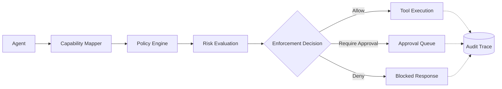

# ShadowAudit

<p align="center">
  <strong>Runtime authorization and policy enforcement infrastructure for AI agents.</strong>
</p>

<p align="center">
  <a href="https://pypi.org/project/shadowaudit/"></a>
  <a href="https://pypi.org/project/shadowaudit/"></a>
  <a href="LICENSE"></a>
  
</p>

---

ShadowAudit provides runtime authorization and deterministic policy enforcement for AI agent execution. It sits between an agent and its tools to evaluate capabilities, apply context-aware policies, and deterministically block or pause unsafe actions before they reach your infrastructure.

## The Problem

Agents can now execute real-world tools—writing to databases, provisioning infrastructure, and executing shell commands. However, existing security measures like prompt guardrails are fundamentally probabilistic. LLMs will ignore instructions during prompt injections, context overflows, or complex reasoning chains. 

To run agents in production, execution boundaries require deterministic enforcement.

## Dangerous Tool Execution Blocked

ShadowAudit evaluates real tool arguments at runtime and fail-closed blocks dangerous actions before they reach the execution engine.

```python
from shadowaudit.core.gate import Gate

gate = Gate(policy_path="policies/production_shell_policy.yaml")

# Agent attempts a destructive command
result = gate.evaluate(
    agent_id="ops-agent-1",
    task_context="shell",
    capability="shell.execute",
    payload={"command": "rm -rf /var/lib/postgresql"}
)

if not result.passed:
    print("BLOCKED")
    print(f"Capability: {result.metadata.get('capability', 'shell.execute')}")
    print(f"Risk Level: critical")
    print(f"Policy: production_shell_policy")
    print(f"Action: denied")
```

**Expected Output:**
```text
BLOCKED
Capability: shell.execute
Risk Level: critical
Policy: production_shell_policy
Action: denied
```

## Quickstart

Wrap any framework's tool with a lightweight ShadowAudit adapter to instantly govern execution.

```bash
pip install shadowaudit pyyaml
```

```python
from shadowaudit.framework.langchain import ShadowAuditTool
from langchain.tools import ShellTool

# Wrap the tool to enforce policies transparently
safe_tool = ShadowAuditTool(
    tool=ShellTool(),
    agent_id="ops-agent",
    capability="shell.execute"
)
```

## Policy-as-Code

ShadowAudit uses a deterministic, YAML-based policy engine designed for scale and enterprise environments.

```yaml
deny:
  - capability: filesystem.delete
  - capability: shell.root_access

require_approval:
  - capability: payments.transfer
    amount_gt: 1000

allow:
  - capability: filesystem.read
```

## Runtime Governance Lifecycle



## Replay + Explainability

ShadowAudit features a deterministic replay and trace engine. Every decision is cryptographically logged and explainable.

**Trace Execution:**
```bash
shadowaudit trace <trace_id>
```
Output clearly shows the execution flow, triggered rules, capability mapping, and the exact enforcement chain.

**Replay Historic Traces:**
```bash
shadowaudit replay trace.jsonl
```
Test deterministic replay capabilities, analyze offline audit trails, and debug past sessions without executing actual tools.

## Human Approval Workflows

Not all actions should be instantly blocked or blindly allowed. Enterprise governance requires escalation flows. 

```yaml
require_approval:
  - capability: production.database.write
```

When an agent attempts this action, execution pauses and the payload is pushed to an approval queue. Human operators authorize or reject the request via the CLI or an integrated Approval Provider plugin.

```bash
# View pending requests
shadowaudit pending-approvals

# Approve request
shadowaudit approve req-1234
```

## MCP Governance

ShadowAudit is the **runtime governance layer for MCP ecosystems**. 

While the Model Context Protocol (MCP) securely connects agents to tools, it does not provide granular authorization rules. ShadowAudit runs as a transparent gateway proxy to intercept JSON-RPC messages and enforce deterministic governance.

```python
from shadowaudit.mcp.gateway import MCPGatewayServer

gateway = MCPGatewayServer(
    upstream_command=["python", "-m", "mcp_server_filesystem", "/tmp"],
    policy_path="policies/mcp_restrictions.yaml"
)
gateway.run()
```

## Policy Simulation

Safely test policy changes against historical traffic before enforcing them in production to evaluate risk deltas.

```bash
# Replay historical sessions to compare policy outcomes
shadowaudit simulate session.json --policy alternative.yaml --compare
```

Simulation shows deterministic comparisons, revealing exactly where a new policy diverges from previous enforcement outcomes.

## Structured Audit Logging

Auditing is local-first, JSON-structured, and strictly deterministic.

```bash
shadowaudit logs --agent "finance-agent"
```

```json
{
  "timestamp": 1715492534.123,
  "agent_id": "finance-agent",
  "task_context": "stripe_transfer",
  "capability": "payments.transfer",
  "decision": "require_approval",
  "payload_hash": "a8f5f167f44f..."
}
```
Audit logs remain completely isolated and replay-compatible.

## Plugin Ecosystem

ShadowAudit’s architecture is fully extensible. You can integrate custom logic into the policy evaluation chain.

```text
plugins/
  shell_guard/           # Advanced shell sandboxing heuristics
  sql_risk_engine/       # AST parsing for destructive SQL
  pii_detector/          # Regex/NER-based data exfiltration checks
  mcp_governance/        # Specialized MCP connection routing
```

## Integrations

Wrap frameworks seamlessly without heavily modifying your orchestration logic:
- LangChain
- OpenAI Agents SDK
- CrewAI
- AutoGen
- MCP (Model Context Protocol)
---
*ShadowAudit provides runtime authorization and deterministic policy enforcement for AI agent execution.*
