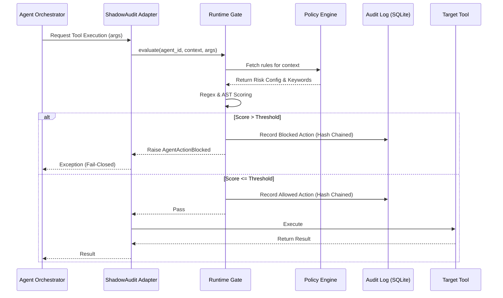

# ShadowAudit Architecture

ShadowAudit provides a fail-closed, deterministic runtime gate that evaluates agent tool calls against configurable policies before they are executed. 

## High-Level Flow

## Core Components

### 1. Framework Adapters
Lightweight wrappers that sit transparently between an agent orchestrator (e.g., LangChain, OpenAI Agents) and the tools. They extract the payload, invoke the `Gate`, and either raise a blockage exception or pass the call through.

### 2. Runtime Gate (`Gate`)
The primary entry point for evaluation. It coordinates the Risk Scorer, the State Machine, and the Audit Logger. It ensures that any evaluation failure results in a `FailClosed` state.

### 3. Risk Evaluator (Scorer)
Determines the risk of a given payload.
- **Keyword Matcher**: Detects restricted substrings.
- **Regex + AST Scorer**: Uses whole-word boundaries and parses Python ASTs (when applicable) to detect dangerous constructs like `subprocess.run` or `eval()`.

### 4. Hash-Chained Audit Log
Every decision is recorded immutably.
- **Append-only**: Stored in a local SQLite database.
- **Hash-chained**: Each row's SHA-256 hash includes the hash of the previous row.
- **Tamper-evident**: Modifying or deleting any historical row breaks the cryptographic chain, immediately detectable via `shadowaudit verify`.

## Enforcement Model

ShadowAudit operates **outside the LLM**. Traditional guardrails attempt to filter the prompt or the output using another LLM. This is slow and vulnerable to prompt injection. ShadowAudit operates purely on the structured JSON or string arguments that the LLM is attempting to pass to the tool.

This deterministic approach guarantees that even if an LLM goes rogue, the physical execution layer is protected by standard software engineering policies.
