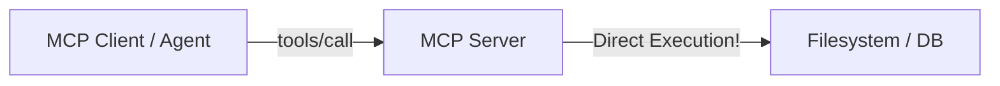
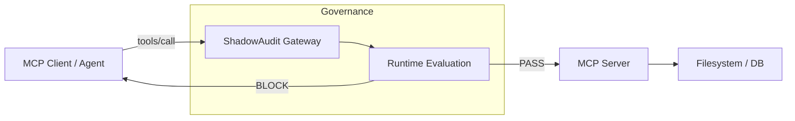

# MCP Governance with ShadowAudit

The Model Context Protocol (MCP) standardizes how AI agents connect to data sources and tools. While MCP provides a clean integration layer, it inherently expands the attack surface by exposing local filesystems, databases, and enterprise APIs to autonomous agents.

ShadowAudit acts as the **runtime governance layer for MCP**.

## The Authorization Gap in MCP

Standard MCP servers execute any tool call they receive. If an agent is tricked via prompt injection or hallucinations, it can instruct the MCP server to read sensitive files or execute destructive commands.



## The ShadowAudit MCP Gateway

ShadowAudit provides a transparent, stdio-proxying gateway. It wraps any standard MCP server. 



### Key Benefits

1. **Deterministic Enforcement**: Evaluate the exact JSON-RPC payload (`params.arguments`) against your policy before it reaches the MCP server.
2. **Fail-Closed Blockage**: If an MCP tool call attempts to access a protected resource, the Gateway intercepts the call and returns a standardized JSON-RPC Error (`-32000`) instead of executing.
3. **Audit Trail**: Every MCP interaction is cryptographically recorded in the local hash-chained SQLite log for compliance reporting.

## Example Usage

Run the ShadowAudit gateway as a wrapper around an existing MCP server (like the filesystem server):

```python
from shadowaudit.mcp.gateway import MCPGatewayServer
from shadowaudit.core.gate import Gate

gateway = MCPGatewayServer(
    # The actual MCP server command
    upstream_command=["python", "-m", "mcp_server_filesystem", "/tmp"],
    gate=Gate(),
    agent_id="mcp-agent-1"
)

# Start proxying stdio streams
gateway.run() 
```

Whenever the MCP Client attempts to call a tool, ShadowAudit intercepts the message, extracts the arguments, scores them against the configured risk taxonomy, and either forwards the JSON-RPC message to the upstream server or blocks it immediately.
