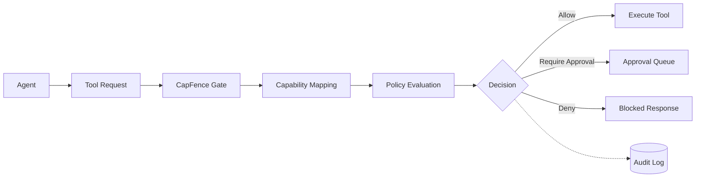

# Enforcement Flow

CapFence enforces policy at the final boundary before a tool executes.

## Steps

1. The agent attempts to call a tool.
2. CapFence maps the request to a capability.
3. The gate evaluates policy-as-code.
4. The decision is returned before execution.
5. The decision is recorded for audit and replay.

## Decision types

| Decision | Runtime behavior |
|---|---|
| Allow | The tool executes. |
| Require approval | Execution pauses until a reviewer approves. |
| Deny | The tool does not execute. |

The enforcement path does not require an LLM call.

